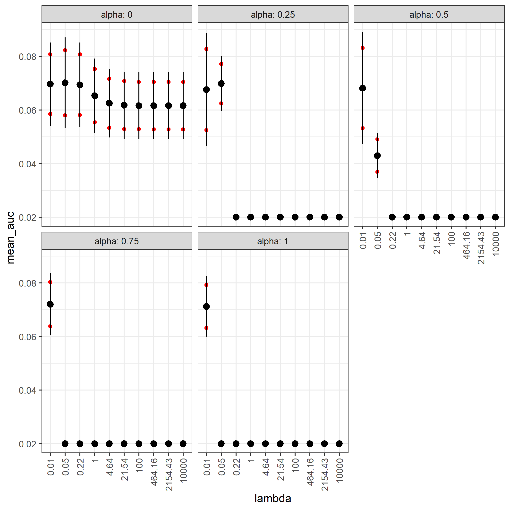

--- 
title: |
  | Introduction to Machine Learning
  | (NPFL054)
author: "François Leroy, PhD student at CZU"
date: "`r Sys.Date()`"
output: pdf_document
documentclass: report
classoption: oneside
fontsize: 12pt
linestretch: 1.5
geometry:
- left = 2cm
- right = 2cm
- top = 2cm
- bottom = 2cm
colorlinks: yes
link-citations: yes
github-repo: FrsLry/HW1_ML_CUNI_leroy
subtitle: Homework 2
---

```{r, echo = F}
knitr::opts_chunk$set(warning = F,
                      message = F)
```

# Set up the project {-}

```{r}
rm(list = ls())
library(ISLR) # for the data
library(tidyverse) # convenient
library(rpart) # for decision trees
library(randomForest) # for ensemble learning
library(glmnet) # for regularized logistic regression
library(ROCR) # for ROC curves
```

```{r}
## Reproduce the result
set.seed(123)
## Create the splitting vector
split <- sample(nrow(Caravan), 1000)
## Create the test dataset
d_test <- Caravan[split,]
## Create the training dataset
d_train <- Caravan[-split,]
```


# Task 1 - Data analysis

* **First, check the distribution of the target attribute. What would be your precision if you select 100 examples by chance?**

```{r}
round(table(Caravan$Purchase), 2)
```

```{r, echo=F}
Caravan %>% 
  ggplot()+
  geom_bar(aes(x = Purchase, y = ..prop.., group = 1), stat = "count")+
  ylab("Proportion")+
  theme_bw()
```

```{r}
plot(dbinom(1:20, size = 100, prob = .06))
```


We can see that there is `r paste0(round(table(Caravan$Purchase)/nrow(Caravan), 2)[1]*100, "%")` of customers who didn't purchase  the insurance and that `r paste0(round(table(Caravan$Purchase)/nrow(Caravan), 2)[2]*100, "%")` who did. As the precision is the number of examples classified as *Yes* when the value is actually *Yes*, by chance, the precision should be `r round(table(Caravan$Purchase)/nrow(Caravan), 2)[2]`.

* **1.a. Focus on the customer type MOSHOOFD: create a table with the number of customers that belong to each of 10 L2 groups and the percentage of customers that purchased a caravan insurance policy in each group. Comment the figures in the table. Then do the same for the customer subtype MOSTYPE (41 subgroups defined in L1).** 

\underline{MOSHOOFD type:}

```{r}
Caravan %>% 
  count(MOSHOOFD, Purchase) %>% 
  group_by(MOSHOOFD) %>% 
  summarise(size = sum(n),
            purchase_prop = round(n[Purchase == "Yes"]/sum(n), 2)) %>% 
  rename(group = MOSHOOFD) %>% 
  kableExtra::kable()
```

From this first table, we can see that the customers that are more prone to purchase an insurance (13% of them) are the one belonging to the group 2, *i.e.* the *driven growers*. On the other hand, the customers belonging to the class 6 and 10, respectively the *cruising seniors* and the *farmers*, are less likely to subscribe to the insurance (only 2% in each group).

\underline{MOSHOOFD type:}

```{r}
table <- 
Caravan %>% 
  count(MOSTYPE, Purchase) %>% 
  group_by(MOSTYPE) %>% 
  summarise(size = sum(n),
            purchase_prop = round(n[Purchase == "Yes"]/sum(n), 2)) %>% 
  rename(group = MOSTYPE) %>% 
  arrange(desc(purchase_prop))
## Display in 2 columns
kableExtra::kable(list(table[1:(nrow(table)/2),], 
                       table[((nrow(table)/2)+1):nrow(table),])) %>% 
  kableExtra::kable_styling(latex_options = "HOLD_position")
```

The two groups more prone to buy an insurance are the group 8 and 12, which correspond respectively to *middle class families* and *affluent young families*. Thus, we can say that families are potential good targets to sell insurances. We can see that the class 25, 26, 27 and 29 all have a low proportion of individuals buying a insurance. They are all related to old people (*i.e.*, *Young seniors in the city*, *Own home elderly*, *Seniors in apartments*, *Porchless seniors: no front yard*). Thus, old people are not a good target to sell insurances. 

**1.b. Analyze the relationship between features MOSHOOFD and MOSTYPE.**

```{r}
Caravan %>% 
  ggplot(aes(y = MOSTYPE, x = MOSHOOFD))+
  geom_point()+
  geom_smooth(method = "lm")+
  theme_bw()
```

We can clearly see a relationship between these two features which are MOSHOOFD = *Customer main type* and MOSTYPE = *Customer Subtype*. This is expected because MOSTYPE is just a more precise social position. For instance, we can see that when $MOSHOOFD = 10$, $MOSTYPE = 40 | 41$. We can see that $MOSHOOFD = 10$ correspond to *Farmers* and that $MOSTYPE = 40 | 41$ are two subclasses of farmers: *Large family farms* and *Mixed rurals*, respectively. 

# Task 2 - Model fitting, optimization, and selection

## Decision tree

```{r}
## Function to randomly extract the test dataset in d_train 
## using always the same number of positive and negative 
## values of Purchase
prepare_cv_folds <-  function(k){
  # Create the subsets data containing Purchase == Yes 
  # in one hand and Purchase == No in an other hand
  pos_data <- d_train[d_train$Purchase == "Yes",]
  neg_data <- d_train[d_train$Purchase == "No",]
  ## Compute the size of each fold
  fold.size.pos <- nrow(pos_data)%/%k
  fold.size.neg <- nrow(neg_data)%/%k
  ## Randomly rearrange the indexes
  set.seed(12); s_pos <- sample(nrow(pos_data))
  set.seed(12); s_neg <- sample(nrow(neg_data))
  ## create the list that will contain the test folds
  f.idx <-  list()
  ## For each fold, extract the dataset that will be used as test
  for(i in 1:k){
      f.idx[[i]] <- 
        rbind(pos_data[s_pos[(1 + (i-1)*fold.size.pos):(i*fold.size.pos)],],
              neg_data[s_neg[(1 + (i-1)*fold.size.neg):(i*fold.size.neg)],])
  }
  return(f.idx)
}
## Use the function to create the 10 test datasets
split_data <- prepare_cv_folds(10)
```


```{r, echo=F, eval=F}
set.seed(123)
## Sequence of cp
seq <- seq(1e-05, 0.001, length.out = 10)
## table that will contain the auc for each fold
auc_table <- tibble(auc = as.numeric())
## table summarizing the cv for each cp
dt_auc <- tibble(cp = as.numeric(),
                 mean_auc = as.numeric(),
                 sd = as.numeric(),
                 low_CI = as.numeric(),
                 high_CI  = as.numeric())
## Loop over each cp
for(j in 1:length(seq)){
  ## Loop over each fold
  for(i in 1:10){
    ## Get the indexes of the test datasets
    test_index <- rownames(split_data[[i]])
    ## Learn decision tree without the test dataset 
    DT <- rpart(Purchase ~ ., cp = seq[j],
                data = d_train %>% filter(!rownames(.) %in% test_index))
    pred <- predict(DT, newdata = split_data[[i]], type = "class")
    auc <- performance(prediction(as.numeric(pred), 
                                  as.numeric(split_data[[i]]$Purchase)),
                measure="auc", fpr.stop = .2)
    auc <- auc@y.values[[1]]
    auc_table[i, 1] <- auc
  }
  ## Fill the table
  dt_auc[j, 1] <- seq[j]
  dt_auc[j, 2] <- mean(auc_table$auc)
  dt_auc[j, 3] <- sd(auc_table$auc)
  dt_auc[j, 4] <- t.test(auc_table$auc)$"conf.int"[1]
  dt_auc[j, 5] <- t.test(auc_table$auc)$"conf.int"[2]
}
## Plot the table
dt_auc %>% 
  ggplot(aes(x = cp, y = mean_auc))+
  geom_point()+
  geom_point(aes(y = high_CI), color = "red")+
  geom_point(aes(y = low_CI), color = "red")+
  geom_pointrange(aes(ymin = mean_auc - sd, ymax = mean_auc + sd))+
  ylim(0, .05)+
  theme_bw() 
ggsave("data/cv_dt.png")
```

```{r, echo=F}

```


The graphique above shows the mean AUC as a function of different values of cp. The black lines represent the standard deviation and the red dots the Confidence Intervals. As we can see on this plot, reducing the complexity parameter below $cp = 0.001$ doesn't change the mean $AUC_{0.2}$. This means that $cp = 0.001$ is already sufficiently low. As a low cp means a more complex model, we are looking for the highest value of cp maximizing the mean AUC. Thus, we can select $cp = 0.001$ to learn the decision tree. 

However, as we can see, the mean AUC is always equal to 0.027, which is rather disappointing.


## Random Forest


```{r, echo=F, eval=F}
set.seed(123)
## Sequence of mtry
seq_mtry <- round(seq(2, 89, length.out = 6))
## Sequence of trees
seq_tree <- round(seq(10, 150, length.out = 10))
## table that will contain the auc for each fold
auc_table <- tibble(auc = as.numeric())
## table summarizing the cv for each cp
dt_auc <- tibble(ntree = as.numeric(),
                 mean_auc = as.numeric(),
                 sd = as.numeric(),
                 low_CI = as.numeric(),
                 high_CI  = as.numeric(),
                 mtry = as.numeric())
## Loop over each mtry
for(m in 1:length(seq_mtry)){
  ## Loop over each ntree
  for(j in 1:length(seq_tree)){
    ## Loop over each fold
    for(i in 1:10){
      ## Get the indexes of the test datasets
      test_index <- rownames(split_data[[i]])
      ## Learn decision tree without the test dataset 
      DT <- randomForest(Purchase ~ ., ntree = seq_tree[j], mtry = seq_mtry[m],
                  data = d_train %>% filter(!rownames(.) %in% test_index))
      pred <- predict(DT, newdata = split_data[[i]], type = "class")
      auc <- performance(prediction(as.numeric(pred), 
                                    as.numeric(split_data[[i]]$Purchase)),
                  measure="auc", fpr.stop = .2)
      auc <- auc@y.values[[1]]
      auc_table[i, 1] <- auc
    }
    ## Fill the table
    dt_auc[nrow(dt_auc)+1, 1] <- seq_tree[j]
    dt_auc[nrow(dt_auc), 2] <- mean(auc_table$auc)
    dt_auc[nrow(dt_auc), 3] <- sd(auc_table$auc)
    dt_auc[nrow(dt_auc), 4] <- ifelse(length(unique(auc_table$auc)) == 1, NA, t.test(auc_table$auc)$"conf.int"[1])
    dt_auc[nrow(dt_auc), 5] <- ifelse(length(unique(auc_table$auc)) == 1, NA, t.test(auc_table$auc)$"conf.int"[2])  
    dt_auc[nrow(dt_auc), 6] <- seq_mtry[m]
  }
  
}
## Plot the table
dt_auc %>% 
  ggplot(aes(x = ntree, y = mean_auc))+
  geom_point()+
  geom_point(aes(y = high_CI), color = "red")+
  geom_point(aes(y = low_CI), color = "red")+
  facet_wrap(. ~ mtry)+
  geom_pointrange(aes(ymin = mean_auc - sd, ymax = mean_auc + sd))+
  ylim(0, .05)+
  theme_bw()

ggsave("data/cv_rf.png")
```

```{r, echo=F}

```


This plot shows the mean auc as a function of the number of trees. Each square correspond to a value of mtry indicated in the grey square. As we can see, the highest value of $AUC_{0.2}$ is for $mtry = 72$ and $ntree = 10$.

However, we must keep in mind that the Confidence Intervals always overlap, which means that the difference between the mean $AUC_{0.2}$ are not significant. 

## Regularized logistic regression

```{r, echo=F, eval=F}
# 5 different alpha values
alphas <- seq(0, 1, length.out = 5)
# 100 different lambda values
grid <- 10^seq(4, -2, length = 10)
## table that will contain the auc for each fold
auc_table <- tibble(auc = as.numeric())
## Table that will contain the summarized info
glmnet_table <- tibble(alpha = as.numeric(),
                       lambda = as.numeric(),
                       mean_auc = as.numeric(),
                       sd = as.numeric(),
                       low_CI = as.numeric(),
                       high_CI  = as.numeric())
## Loop over each alpha
for(iii in 1:length(alphas)){
  ## Loop over each lambda
  for(ii in 1:length(grid)){
    ## Loop over each fold
    for(i in 1:10){
      ## Get the indexes of the test datasets
      test_index <- rownames(split_data[[i]])
      ## Create the temporary training data
      temp_train <- d_train %>% filter(!rownames(.) %in% test_index)
      ## Shape the train data for glmnet()
      x <- model.matrix(Purchase~., data = temp_train)
      y <- data.matrix(ifelse(temp_train$Purchase == "No", 0, 1))
      ## Shape the test data
      x.test <- model.matrix(Purchase~., data = split_data[[i]])
      y.test <- data.matrix(ifelse(split_data[[i]]$Purchase == "No", 0, 1))
      ## Learn the model
      model <- glmnet(x, y, alpha = alphas[iii], family = "binomial", lambda = grid[ii])
      ## Predict with the model
      pred <- predict(model, newx = x.test, type = "class")
      ## Compute auc
      auc <- performance(prediction(as.numeric(pred), 
                                      as.numeric(y.test)),
                    measure="auc", fpr.stop = .2)
      auc <- auc@y.values[[1]]
      auc_table[i, 1] <- auc
    }
    glmnet_table[nrow(glmnet_table)+1, 1] <- alphas[iii]
    glmnet_table[nrow(glmnet_table), 2] <- grid[ii] 
    glmnet_table[nrow(glmnet_table), 3] <- mean(auc_table$auc)
    glmnet_table[nrow(glmnet_table), 4] <- sd(auc_table$auc)
    glmnet_table[nrow(glmnet_table), 5] <- ifelse(length(unique(auc_table$auc)) == 1, NA, t.test(auc_table$auc)$"conf.int"[1])
    glmnet_table[nrow(glmnet_table), 6]<- ifelse(length(unique(auc_table$auc)) == 1, NA, t.test(auc_table$auc)$"conf.int"[2])
  }
}
## Plot
glmnet_table %>% 
  ggplot(aes(x = as.factor(lambda), y = mean_auc))+
  geom_point()+
  geom_point(aes(y = high_CI), color = "red")+
  geom_point(aes(y = low_CI), color = "red")+
  facet_wrap(. ~ alpha)+
  geom_pointrange(aes(ymin = mean_auc - sd, ymax = mean_auc + sd))+
  ylim(0, .05)+
  theme_bw()
ggsave("data/cv_lr.png")
```

```{r, echo=F}

```

